# Setup

```{r message=FALSE, warning=FALSE}
library(posterior)
library(bayesplot)
library(dplyr)
library(tidyr)
library(purrr)
library(ggplot2)
library(stringr)
library(readr)
library(tibble)
library(knitr)
library(patchwork)

set.seed(42)
options(mc.cores = parallel::detectCores())

color_scheme_set("blue")
```


# Navigation

- [Motivation](#motivation)
- [Model Specification](#model-specification)
- [Applied Example: NOAA Monthly CO2 Data (Model Fit & diagnostics Check)](#applied-example)
- [Model Comparison](#model-comparison)
- [Interpretation](#interpretation)
- [Limitations and Extensions](#limitations)


#  Motivation {#motivation}

Before diving into the mathematical framework and code implementation of Dynamic Linear Models (DLMs, also known as State-Space Models), it is essential to understand why this methodology is necessary for time series analysis.

When applying standard regression models to time series data, we run into two major theoretical limitations:

* **Violation of the i.i.d. Assumption:** Standard regression models generally assume that errors are independent or exchangeable. However, time series data inherently exhibits serial correlation. Ignoring this temporal dependence leads to severely underestimated standard errors and artificially narrow posterior intervals.
* **Static vs. Time-Varying Parameters:** Standard regressions enforce parameter stationarity, assuming that a coefficient (e.g., $\beta$) remains strictly constant across all time $t$. In reality, data-generating processes are rarely this stable; they frequently experience structural breaks, regime shifts, or continuous drift.

To overcome these challenges, **Dynamic Linear Models** provide a highly flexible and rigorous framework. Instead of assuming a static relationship, DLMs treat the system as evolving over time. This approach solves the limitations of standard regression in several key ways:

1.  **Decomposing Uncertainty:** DLMs explicitly separate *observation error* (the noise in our measurements) from *process error* (the actual structural evolution of the underlying system).
2.  **Handling Dynamic Parameters:** Regression coefficients in DLMs do not have to be fixed; they can be modeled as latent states that evolve stochastically over time (for example, as a random walk).
3.  **Latent State Inference:** DLMs allow us to model and perform statistical inference on the hidden, unobserved processes driving the data.
4.  **Seamless Handling of Missing Data:** Because of their sequential nature, DLMs can naturally integrate missing observations into the posterior predictive distributions without breaking the model.

Because of this flexibility, DLMs appear practically everywhere. You use them whenever a system evolves over time and you only have imperfect observations of it. Common applications include tracking inflation or business cycles in **Economics**, signal filtering and target tracking in **Engineering**, modeling epidemic trajectories in **Public Health**, and monitoring temperature trends or pollution levels in **Environmental Science**, which leads us directly into our applied example using the NOAA Atmospheric CO2 dataset.


#  Model Specification {#model-specification}

A Dynamic Linear Model, or DLM, is a Bayesian state-space model for time series data. The central idea is that the observed data are not modeled as a fixed deterministic function of time. Instead, each observation is treated as a noisy measurement of an unobserved latent state that evolves over time. This distinction is important because many time series are driven by an underlying process that cannot be directly observed. The DLM framework separates the measurement error in the observed data from the process error in the evolution of the hidden state.

The general DLM is built from two linked equations: an observation equation and a state equation.

## likelihood of DLMs

The observation equation describes how the observed data are generated from the latent state. For a univariate time series, it can be written as

\[
y_t = \mathbf{F}_t^\top \boldsymbol{\theta}_t + v_t,
\qquad
v_t \sim \mathcal{N}(0, V).
\]

Equivalently, the conditional likelihood is

\[
p(y_t \mid \boldsymbol{\theta}_t, V)
=
\mathcal{N}(\mathbf{F}_t^\top \boldsymbol{\theta}_t, V).
\]

In this equation,

- \(y_t\) is the observed value at time \(t\)
- \(\boldsymbol{\theta}_t\) is the latent state vector.
- \(\mathbf{F}_t\) links the latent state to the observed data,
- \(V\) is the observation variance.

Substantively, \(V\) represents measurement error or short-term noise in the observed time series. A smaller value of \(V\) means the model trusts the observations more strongly, while a larger value of \(V\) means the model treats the observations as noisier.

The second part of the model is the state equation, which describes how the latent state changes over time:

\[
\boldsymbol{\theta}_t
=
\mathbf{G}_t \boldsymbol{\theta}_{t-1}
+
w_t,
\qquad
w_t \sim \mathcal{N}(0, W).
\]

Equivalently,

\[
p(\boldsymbol{\theta}_t \mid \boldsymbol{\theta}_{t-1}, W)
=
\mathcal{N}(\mathbf{G}_t \boldsymbol{\theta}_{t-1}, W).
\]

Here,

- \(\mathbf{G}_t\) is the evolution matrix that controls how the previous state
- \(\boldsymbol{\theta}_{t-1}\) is transformed into the current state \(\boldsymbol{\theta}_t\)
- \(w_t\) is the innovation term that represents process noise

\(W\) is its covariance matrix. While \(V\) controls the amount of observation noise, \(W\) controls how much the latent state is allowed to change over time. A smaller \(W\) produces a smoother state trajectory, while a larger \(W\) allows the latent process to adapt more flexibly to local changes.

The latent state vector can be designed to represent different dynamic components, depending on the application. For example, \(\boldsymbol{\theta}_t\) may contain a local level, a time-varying trend, seasonal effects, or time-varying regression coefficients. This is one reason DLMs are flexible: the same general framework can describe many different time series structures by changing the definitions of \(\mathbf{F}_t\), \(\mathbf{G}_t\), and \(\boldsymbol{\theta}_t\).

Therefore, The DLM has a natural hierarchical structure:

\[
(V, W, \boldsymbol{\theta}_0)
\rightarrow
\boldsymbol{\theta}_{1:T}
\rightarrow
y_{1:T}.
\]

This hierarchy means that the initial state and variance components define the distribution of the latent state sequence, and the latent state sequence then generates the observed data.

## Prior

To complete the Bayesian specification, we place priors on the root quantities of the model.

Firstly, A common prior for the initial state is

\[
\boldsymbol{\theta}_0 \sim \mathcal{N}(\mathbf{m}_0, \mathbf{C}_0),
\]

where \(\mathbf{m}_0\) and \(\mathbf{C}_0\) encode what we believe about the initial latent state before observing the data.

Secondly, DLMs also need priors for the variance components \(V\) and \(W\). In practice, it is common to place priors on their standard deviation parameters, such as

\[
\sigma_v = \sqrt{V},
\qquad
\sigma_w = \sqrt{W},
\]

with positive priors such as half-normal, exponential, or half-Cauchy distributions. For example,

\[
\sigma_v \sim \text{Half-Normal}(0, s_v),
\]

\[
\sigma_w \sim \text{Half-Normal}(0, s_w).
\]

These priors are not just technical details. They influence how the model balances smoothness and flexibility. A tight prior on \(\sigma_w\) favors a smoother latent state, while a weaker prior allows more local movement.

Importantly, the prior on the state innovation variance affects the geometry of the fitted time series. A Gaussian innovation prior ($w_t \sim \mathcal{N}(0, \sigma_w^2)$) typically produces smooth and gradual changes, while heavier-tailed innovation priors ($w_t \sim t_{\nu}(0, s)$) can produce small changes (flat periods) over time but allow occasional jumps or structural breaks.


## Key Assumption

Several assumptions are important when using a standard DLM. First, the model assumes the Markov property for the latent states:

\[
p(\boldsymbol{\theta}_t \mid \boldsymbol{\theta}_{1:t-1})
=
p(\boldsymbol{\theta}_t \mid \boldsymbol{\theta}_{t-1}).
\]

This means that the current state contains all information needed to predict the next state. The future depends on the present state, not on the entire past history once the present state is known.

Second, the model assumes conditional independence of the observations given the latent states:

\[
p(y_{1:T} \mid \boldsymbol{\theta}_{1:T}, V)
=
\prod_{t=1}^{T}
p(y_t \mid \boldsymbol{\theta}_t, V).
\]

This does not mean the raw observations are independent. Rather, it means that after conditioning on the latent state sequence, the remaining observation errors are independent.

Third, the standard DLM assumes linearity and Gaussianity. The observation equation is linear in the latent state through \(\mathbf{F}_t^\top \boldsymbol{\theta}_t\), and the state equation is linear in the previous state through \(\mathbf{G}_t \boldsymbol{\theta}_{t-1}\). The noise terms \(v_t\) and \(w_t\) are usually assumed to be Gaussian. These assumptions make the model interpretable and computationally convenient, but they can be relaxed in more advanced state-space models.

Overall, the DLM provides a clear probabilistic structure for dynamic data. The observation equation explains how noisy data arise from hidden states, the state equation explains how those hidden states evolve, the priors control uncertainty and smoothness, and the hierarchical structure connects all components into one Bayesian model.


#   Applied Example: NOAA Monthly CO2 Data (Model Fit & diagnostics Check) {#applied-example}

## Data loading and exploratory analysis {-}

We use the same NOAA monthly background-station panel as the project code. The data-loading logic below follows the structure in `group-time-series/code/Rscript/run_bayesian_model.R`, and all Stan programs shown later are read directly from `group-time-series/code/Rstan/`.

```{r tutorial-helpers}
test_months_n <- 24
site_codes <- c("BRW", "MLO", "SMO", "SPO")
start_date <- as.Date("2000-01-01")
code_data_dir <- file.path("..", "code", "Data", "NOAA_CO2_Monthly")

monthly_cols <- c(
  "site_code", "year", "month", "day", "hour", "minute", "second",
  "datetime", "time_decimal", "midpoint_time", "value", "value_std_dev",
  "nvalue", "latitude", "longitude", "altitude", "elevation",
  "intake_height", "qcflag"
)

expected_filename <- function(site_code) {
  sprintf("co2_%s_surface-insitu_1_ccgg_MonthlyData.txt", tolower(site_code))
}

ensure_monthly_file <- function(site_code, data_dir = code_data_dir) {
  dir.create(data_dir, recursive = TRUE, showWarnings = FALSE)

  file_path <- file.path(data_dir, expected_filename(site_code))

  if (!file.exists(file_path)) {
    url <- paste0(
      "https://gml.noaa.gov/aftp/data/trace_gases/co2/in-situ/surface/txt/",
      expected_filename(site_code)
    )
    utils::download.file(url, destfile = file_path, mode = "wb", quiet = TRUE)
  }

  file_path
}

read_noaa_monthly <- function(path) {
  raw <- utils::read.table(
    file = path,
    header = FALSE,
    comment.char = "#",
    fill = TRUE,
    quote = "",
    stringsAsFactors = FALSE
  )

  raw <- raw[, seq_along(monthly_cols)]
  names(raw) <- monthly_cols

  raw %>%
    transmute(
      site_code = toupper(trimws(as.character(site_code))),
      year = suppressWarnings(as.integer(year)),
      month = suppressWarnings(as.integer(month)),
      value = suppressWarnings(as.numeric(value)),
      value_std_dev = suppressWarnings(as.numeric(value_std_dev)),
      nvalue = suppressWarnings(as.numeric(nvalue)),
      qcflag = trimws(as.character(qcflag))
    ) %>%
    filter(
      !is.na(year),
      !is.na(month),
      month >= 1,
      month <= 12
    ) %>%
    mutate(date = as.Date(sprintf("%04d-%02d-01", year, month))) %>%
    filter(
      !is.na(date),
      !is.na(value),
      !is.na(nvalue),
      nvalue > 0,
      !is.na(qcflag),
      substr(qcflag, 1, 1) == "."
    ) %>%
    select(site_code, date, year, month, value, value_std_dev, nvalue, qcflag)
}

load_panel <- function(site_codes, data_dir = code_data_dir, start_date = as.Date("2000-01-01")) {
  purrr::map_dfr(site_codes, function(sc) {
    read_noaa_monthly(ensure_monthly_file(sc, data_dir = data_dir)) %>%
      mutate(site_code = toupper(sc)) %>%
      filter(date >= start_date)
  })
}

render_stan_file <- function(path) {
  cat("```stan\n")
  cat(paste(readLines(path, warn = FALSE), collapse = "\n"))
  cat("\n```\n")
}

render_script_excerpt <- function(path, start_line, end_line, language = "r") {
  lines <- readLines(path, warn = FALSE)
  idx <- seq.int(start_line, end_line)
  cat(paste0("```", language, "\n"))
  cat(paste(lines[idx], collapse = "\n"))
  cat("\n```\n")
}

read_posterior_table <- function(path, vars) {
  readr::read_csv(path, show_col_types = FALSE) %>%
    filter(variable %in% vars) %>%
    transmute(
      parameter = variable,
      mean = round(mean, 3),
      sd = round(sd, 3),
      lo89 = round(eti89_lb, 3),
      hi89 = round(eti89_ub, 3),
      rhat = round(r_hat, 3),
      ess_bulk = round(ess_bulk, 1)
    )
}

diag_overview <- function(path) {
  smry <- readr::read_csv(path, show_col_types = FALSE)
  tibble(
    max_rhat = round(max(smry$r_hat, na.rm = TRUE), 3),
    min_ess_bulk = round(min(smry$ess_bulk, na.rm = TRUE), 1)
  )
}
```

```{r co2-data, message=FALSE, warning=FALSE}
df <- load_panel(
  site_codes = site_codes,
  data_dir = code_data_dir,
  start_date = start_date
) %>%
  mutate(month_of_year = month)

all_months <- seq.Date(min(df$date), max(df$date), by = "month")
train_months <- head(all_months, -test_months_n)
test_months <- tail(all_months, test_months_n)

train_df <- df %>%
  filter(date %in% train_months) %>%
  arrange(date, site_code)

test_df <- df %>%
  filter(date %in% test_months) %>%
  arrange(date, site_code)

site_levels <- sort(unique(train_df$site_code))
site_to_id <- setNames(seq_along(site_levels), site_levels)

train_df <- train_df %>%
  mutate(
    site_id = unname(site_to_id[site_code]),
    t_id = match(date, all_months)
  )

test_df <- test_df %>%
  mutate(
    site_id = unname(site_to_id[site_code]),
    t_test = match(date, all_months)
  )

stan_data_bhrq <- list(
  N = nrow(train_df),
  S = length(site_levels),
  T = length(all_months),
  site = train_df$site_id,
  t_id = train_df$t_id,
  month_id = train_df$month_of_year,
  y = train_df$value,
  N_test = nrow(test_df),
  site_test = test_df$site_id,
  t_test = test_df$t_test,
  month_test = test_df$month_of_year
)

stan_data_dlm <- c(
  stan_data_bhrq,
  list(y_test = test_df$value)
)

knitr::kable(
  tibble(
    split = c("Training", "Holdout"),
    start = c(min(train_df$date), min(test_df$date)),
    end = c(max(train_df$date), max(test_df$date)),
    rows = c(nrow(train_df), nrow(test_df))
  ),
  caption = "Train and holdout split used throughout Sections 6.1-6.4"
)
```

```{r quick-eda-series, message=FALSE, warning=FALSE}
site_labels <- c(
  BRW = "Barrow",
  MLO = "Mauna Loa",
  SMO = "American Samoa",
  SPO = "South Pole"
)

plot_df <- df %>%
  mutate(
    site_code = factor(site_code, levels = site_codes),
    site_name = paste0(site_code, " - ", site_labels[as.character(site_code)])
  )

ggplot(plot_df, aes(date, value)) +
  geom_line(linewidth = 0.45) +
  facet_wrap(~ site_name, ncol = 2, scales = "free_y") +
  labs(
    title = "Monthly atmospheric CO2 concentration by monitoring site",
    x = "Date",
    y = "CO2 concentration (ppm)"
  ) +
  theme_bw()
```

```{r quick-eda-seasonality, message=FALSE, warning=FALSE}
seasonal_summary <- df %>%
  group_by(site_code, month) %>%
  summarize(mean_co2 = mean(value, na.rm = TRUE), .groups = "drop") %>%
  mutate(
    site_code = factor(site_code, levels = site_codes),
    site_name = paste0(site_code, " - ", site_labels[as.character(site_code)])
  )

ggplot(seasonal_summary, aes(month, mean_co2)) +
  geom_line(linewidth = 0.6) +
  geom_point(size = 1.8) +
  facet_wrap(~ site_name, ncol = 2, scales = "free_y") +
  scale_x_continuous(breaks = 1:12) +
  labs(
    title = "Average monthly seasonal pattern by monitoring site",
    x = "Month",
    y = "Mean CO2 concentration (ppm)"
  ) +
  theme_bw()
```

```{r quick-eda-table, message=FALSE, warning=FALSE}
eda_summary <- df %>%
  group_by(site_code) %>%
  summarize(
    min = min(value, na.rm = TRUE),
    median = median(value, na.rm = TRUE),
    max = max(value, na.rm = TRUE),
    mean = mean(value, na.rm = TRUE),
    sd = sd(value, na.rm = TRUE),
    n = n(),
    .groups = "drop"
  ) %>%
  mutate(across(where(is.numeric), ~ round(.x, 2)))

knitr::kable(
  eda_summary,
  caption = "Descriptive statistics of monthly CO2 concentration by monitoring site"
)
```

These plots show the same three empirical facts emphasized in the presentation: a strong common upward trend, clear within-year seasonality, and meaningful site heterogeneity. Those three features motivate the progression from a regression-style Bayesian harmonic model to a fully dynamic latent-state model.

This decomposition perspective is the practical starting point for the whole tutorial. We can think of each series as a combination of a long-run trend, a seasonal cycle, and residual noise, then ask step by step which part of that structure each model is able to capture well.

**Important note.** Some models in this project, especially the richer Bayesian state-space models, can take a very long time to run. Because of that, this `.Rmd` is designed primarily to **read already generated results and display them**, rather than to re-run every full model from scratch during knitting. This point is important: for several of the heavier models, re-running everything inside the document would be unnecessarily slow and impractical.

The full runnable analysis code has been organized in `group-time-series/code`, and the execution details are documented in `group-time-series/code/README.md`. If you want to reproduce the full pipeline, follow the instructions in that `README.md` and run the code in that folder; doing so will generate the expected result files that this tutorial reads and summarizes below.

## Harmonic Regression

We begin with the simplest deterministic baseline in the project: fit each site with a linear trend plus a small harmonic basis for annual and semiannual seasonality. This gives a useful reference point because the model is easy to estimate and easy to diagnose, but it does not allow the trend itself to evolve over time.

### Model specification

Let $y_n$ denote the monthly CO$_2$ observation for case $n$, let $s[n]$ index the site, and let $t[n]$ be the within-site month counter. The harmonic-regression baseline uses

$$
y_n = \mu_n + \varepsilon_n, \qquad \varepsilon_n \sim \mathcal{N}(0, \sigma^2),
$$

with

$$
\mu_n =
\alpha_{s[n]}
+ \beta_{s[n]} t[n]
+ \gamma_{1,s[n]} \sin\!\left(\frac{2 \pi t[n]}{12}\right)
+ \gamma_{2,s[n]} \cos\!\left(\frac{2 \pi t[n]}{12}\right)
+ \gamma_{3,s[n]} \sin\!\left(\frac{4 \pi t[n]}{12}\right)
+ \gamma_{4,s[n]} \cos\!\left(\frac{4 \pi t[n]}{12}\right).
$$

So each station gets its own intercept, linear slope, and two harmonic pairs. In the project code this model is fit by weighted least squares, with `nvalue` used as the weight so months with more contributing observations have slightly more influence.

### Fitting code

The core implementation comes from `group-time-series/code/Rscript/run_harmonic_regression.R`. The code below shows the actual fitting and prediction logic used in the project.

```{r harmonic-fit-code, results='asis'}
render_script_excerpt(file.path("..", "code", "Rscript", "run_harmonic_regression.R"), 88, 106)
```

```{r harmonic-metrics, message=FALSE, warning=FALSE}
harmonic_point_metrics <- readr::read_csv(
  "../../results/1/forecast/model1_forecast_point_metrics.csv",
  show_col_types = FALSE
)

harmonic_prob_metrics <- readr::read_csv(
  "../../results/1/forecast/model1_forecast_probabilistic_metrics.csv",
  show_col_types = FALSE
)

harmonic_metric_table <- tibble(
  metric = c("MAE", "RMSE", "LPD"),
  value = c(
    harmonic_point_metrics$mae_test[[1]],
    harmonic_point_metrics$rmse_test[[1]],
    harmonic_prob_metrics$mlpd_test[[1]]
  )
) %>%
  mutate(value = round(value, 3))

knitr::kable(
  harmonic_metric_table,
  caption = "Harmonic-regression holdout forecast metrics from the saved project results"
)
```

The fitted baseline is intuitive and fast, but it is also rigid: the long-run trend is forced to remain linear within each site, and all temporal structure beyond that deterministic trend must be absorbed by the harmonic terms or left behind in the residuals.

### Forecast fit

The first single-model fit plot in the project is generated by the common plotting helper in `group-time-series/code/Rscript/visualize_single_model.R`. I show the plotting code once here; later single-model forecast panels reuse the same helper.

```{r harmonic-forecast-plot-code, results='asis'}
render_script_excerpt(file.path("..", "code", "Rscript", "visualize_single_model.R"), 121, 139)
```

### Residual diagnose

To check what the baseline misses, we examine the residual ACF by site. The project script computes those residuals exactly as follows.

```{r harmonic-acf-code, results='asis'}
render_script_excerpt(file.path("..", "code", "Rscript", "run_harmonic_regression.R"), 163, 176)
render_script_excerpt(file.path("..", "code", "Rscript", "visualize_single_model.R"), 142, 160)
```

```{r harmonic-residual-acf, message=FALSE, warning=FALSE}
harmonic_acf_df <- readr::read_csv(
  "../../results/1/time_series/model1_residual_acf.csv",
  show_col_types = FALSE
) %>%
  mutate(site_name = paste0(site, " - ", site_labels[site]))

ggplot(harmonic_acf_df, aes(lag, acf)) +
  geom_hline(yintercept = 0, color = "grey50") +
  geom_hline(aes(yintercept = ci), color = "red", linetype = "dashed") +
  geom_hline(aes(yintercept = -ci), color = "red", linetype = "dashed") +
  geom_col(fill = "#4c78a8", width = 0.06) +
  facet_wrap(~ site_name, ncol = 2, scales = "free_y") +
  labs(
    title = "Harmonic regression - Residual ACF",
    subtitle = "Training residual autocorrelation by site",
    x = "Lag",
    y = "ACF"
  ) +
  theme_minimal(base_size = 12)
```

### Training and holdout forecast

To close the baseline section, it is useful to look at the training fit and the 24-month holdout forecast together. Here I use the saved baseline results from `results/1/forecast/model1_forecast_predictions.csv`, so the figure below matches the project output directly rather than depending on a fresh re-fit inside the tutorial. This makes the main weakness of harmonic regression more visible: the model captures the broad seasonal cycle, but its deterministic trend is often too smooth to follow the later movement of the series closely.

```{r harmonic-train-test-plot, message=FALSE, warning=FALSE}
harmonic_saved_plot_df <- readr::read_csv(
  "../../results/1/forecast/model1_forecast_predictions.csv",
  show_col_types = FALSE
) %>%
  mutate(
    date = as.Date(date),
    site = factor(site, levels = site_codes),
    site_name = paste0(site, " - ", site_labels[as.character(site)]),
    pred_lo = lo90,
    pred_hi = hi90,
    split = factor(split, levels = c("train", "test"), labels = c("Training", "Holdout"))
  )

ggplot(harmonic_saved_plot_df, aes(x = date)) +
  geom_ribbon(aes(ymin = pred_lo, ymax = pred_hi), fill = "grey80", alpha = 0.6) +
  geom_line(aes(y = actual), color = "black", linewidth = 0.35) +
  geom_line(aes(y = pred_mean, color = site), linewidth = 0.8) +
  scale_color_manual(values = c(BRW = "#1f77b4", MLO = "#d62728", SMO = "#2ca02c", SPO = "#9467bd"), guide = "none") +
  facet_grid(split ~ site_name, scales = "free_y") +
  labs(
    title = "Harmonic regression - Training and holdout forecast",
    subtitle = "Top row = training fit; bottom row = 24-month holdout forecast",
    x = NULL,
    y = expression(CO[2] ~ "(ppm)")
  ) +
  theme_minimal(base_size = 12)
```

This baseline is useful precisely because its weaknesses are easy to see. In the presentation, harmonic regression was the model that first made the problem clear: the fitted curves are often too smooth, and the residual ACF still shows substantial dependence. That is the immediate motivation for moving to the Bayesian harmonic model with a quadratic trend.

## Bayesian Harmonic Regression with a Quadratic Trend (BHRQ)

### Model specification

This model is the direct Bayesian extension of our harmonic-regression baseline. Let $y_n$ denote the monthly CO$_2$ concentration for observation $n$, let $s[n]$ index site, let $t[n]$ index the month in the full time span, and let $m[n] \in \{1,\dots,12\}$ index month of year. We model

$$
y_n \sim \mathcal{N}(\mu_n, \sigma_{\mathrm{obs}, s[n]}),
$$

with

$$
\mu_n =
\alpha + a_{s[n]}
+ (\beta + b_{s[n]}) x_{t[n]}
+ (q + d_{s[n]}) x_{t[n]}^2
+ \mathrm{Season}_{s[n], m[n]},
$$

where

$$
x_t = \frac{t - (T + 1) / 2}{12}.
$$

The first two annual harmonics define

$$
\mathrm{Season}_{s,m} =
\beta_{\sin 1,s}\sin\!\left(\frac{2\pi(m-1)}{12}\right)
+ \beta_{\cos 1,s}\cos\!\left(\frac{2\pi(m-1)}{12}\right)
+ \beta_{\sin 2,s}\sin\!\left(\frac{4\pi(m-1)}{12}\right)
+ \beta_{\cos 2,s}\cos\!\left(\frac{4\pi(m-1)}{12}\right).
$$

#### Prior design

The prior design follows the project Stan file `group-time-series/code/Rstan/BHRQ.stan`. The global intercept, slope, and curvature are centered at scientifically plausible values,

$$
\alpha \sim \mathcal{N}(400, 25^2), \qquad
\beta \sim \mathcal{N}(2.2, 0.8^2), \qquad
q \sim \mathcal{N}(0, 0.08^2),
$$

while site-specific deviations are modeled hierarchically with centered-to-zero raw effects. This gives partial pooling across the four stations and regularizes the curvature terms more strongly than the intercept and slope terms.

These choices are not arbitrary. The prior on $\alpha$ is centered near a realistic atmospheric CO$_2$ level because the monthly series in this sample lives in a fairly narrow physical range, so there is no reason to spend posterior mass on implausibly low or high baselines. The prior on $\beta$ is also informative on purpose: over monthly data, the long-run CO$_2$ increase is positive but gradual, so a slope prior centered on a modest annual increase is scientifically more reasonable than a vague prior that allows extremely steep trends in either direction.

The stronger regularization on curvature is even more deliberate. A quadratic term can mimic long-run bending very easily, so if its prior is too weak, the model may explain ordinary smooth growth by inventing unnecessary curvature. Here we can justify a stronger prior because atmospheric CO$_2$ does not usually change its long-run direction sharply over a relatively short monthly sample. In other words, some curvature is possible, but strong curvature should be exceptional and must be earned from the data.

The hierarchical shrinkage on site effects reflects a second substantive belief: the four stations observe the same broad global carbon system. Their local deviations should exist, but they should usually be smaller than the common trend itself. That is why partial pooling is appropriate here.

### Stan code

```{r bhrq-stan-code, results='asis'}
render_stan_file(file.path("..", "code", "Rstan", "BHRQ.stan"))
```

### Compile and fit the model

The fitting code below mirrors the logic in `group-time-series/code/Rscript/run_bayesian_model.R`. In the rendered tutorial we keep this chunk unevaluated, and the posterior outputs shown later are read from saved project results.

```{r bhrq-fit, eval=FALSE}
library(rstan)

rstan::rstan_options(auto_write = TRUE)
options(mc.cores = parallel::detectCores())

bhrq_mod <- rstan::stan_model(file = "../code/Rstan/BHRQ.stan")

bhrq_fit <- rstan::sampling(
  object = bhrq_mod,
  data = stan_data_bhrq,
  seed = 5440,
  chains = 4,
  cores = 4,
  iter = 2000,
  warmup = 1000,
  refresh = 200,
  control = list(adapt_delta = 0.98, max_treedepth = 13)
)
```

### Posterior diagnose

```{r bhrq-posterior-summary, message=FALSE, warning=FALSE}
bhrq_summary_path <- "../../results/4b/posterior/model4b_posterior_summary.csv"
bhrq_sampler_path <- "../../results/4b/posterior/model4b_sampler_diagnostics.csv"

bhrq_core <- read_posterior_table(
  bhrq_summary_path,
  c(
    "alpha", "beta_global", "q_global",
    "sigma_site_intercept", "sigma_site_slope", "sigma_site_curve",
    "sigma_h1", "sigma_h2"
  )
)

knitr::kable(
  bhrq_core,
  caption = "BHRQ posterior summary for the main global and shrinkage parameters"
)

knitr::kable(
  readr::read_csv(bhrq_sampler_path, show_col_types = FALSE) %>%
    mutate(
      mean_stepsize = signif(mean_stepsize, 3),
      mean_accept_stat = round(mean_accept_stat, 3)
    ),
  caption = "BHRQ sampler diagnostics by chain"
)

knitr::kable(
  diag_overview(bhrq_summary_path),
  caption = "BHRQ convergence overview"
)
```

The BHRQ fit is the cleanest of the four Bayesian models in this tutorial. The maximum $\hat{R}$ is very close to 1, the bulk ESS values are comfortably large, and the saved sampler diagnostics show zero divergences and no max-treedepth hits.

The first posterior plots below are generated by the common plotting script `group-time-series/code/Rscript/visualize_single_model.R`. I show the relevant plotting code once here; the later BDLM, BDLMQ, and BDLM-AR2 posterior panels reuse the same helper functions with different result directories.

```{r posterior-plot-code, results='asis'}
render_script_excerpt(file.path("..", "code", "Rscript", "visualize_single_model.R"), 237, 301)
render_script_excerpt(file.path("..", "code", "Rscript", "visualize_single_model.R"), 386, 388)
```

```{r bhrq-rhat-ess, echo=FALSE, out.width='90%'}
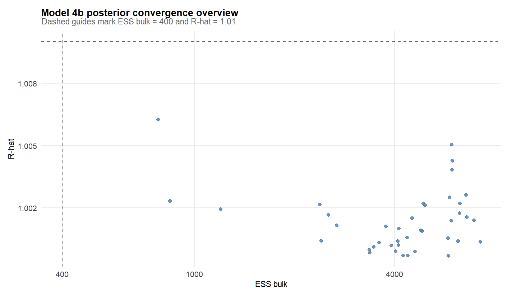
```

```{r bhrq-trace, echo=FALSE, out.width='90%'}
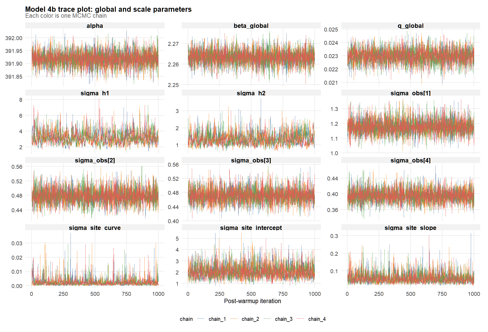
```

The BHRQ fit panel reuses the same single-model forecast plotting helper already shown in the harmonic-regression section.

```{r bhrq-fit-plot, echo=FALSE, out.width='90%'}
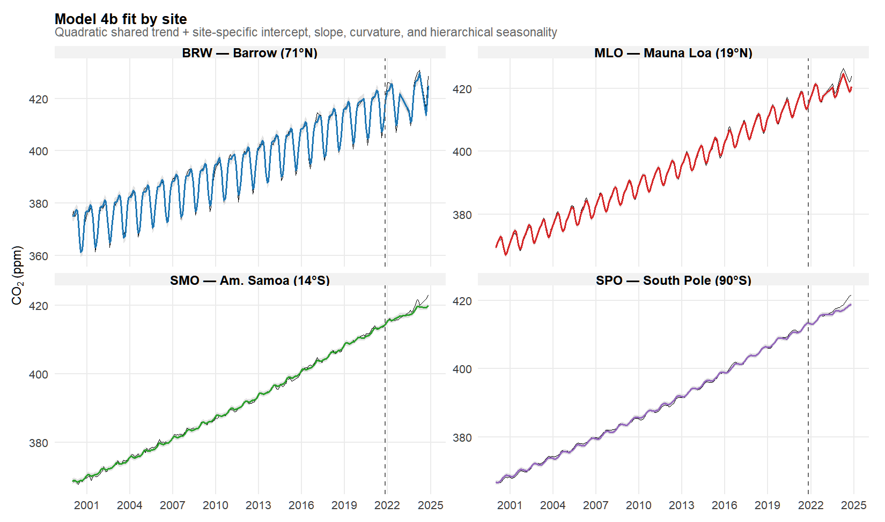
```

Taken together, these outputs suggest that the posterior summaries for BHRQ are stable enough for interpretation. The training fit is already strong, but the model is still fundamentally a structured regression model rather than a fully dynamic latent-state model.

That distinction matters. Even when BHRQ forecasts reasonably well, it still treats the trend as deterministic, so any remaining serial dependence has to leak into the residual term instead of being represented directly as evolving latent structure.

## Bayesian Dynamic Linear Model (BDLM)

### Model specification

The Bayesian Dynamic Linear Model replaces the fixed quadratic mean with a latent local-linear-trend state. The observation equation becomes

$$
y_n \sim \mathcal{N}(\mu_n, \sigma_{\mathrm{obs}, s[n]}),
$$

with

$$
\mu_n =
\ell_{t[n]}
+ a_{s[n]}
+ b_{s[n]} x_{t[n]}
+ \mathrm{Season}_{s[n], m[n]}.
$$

The latent state is the pair $(\ell_t, g_t)$, where $\ell_t$ is the shared latent level and $g_t$ is the shared latent growth rate. Their evolution is

$$
g_t = g_{t-1} + \sigma_g z^{(g)}_{t-1}, \qquad
\ell_t = \ell_{t-1} + g_{t-1} + \sigma_\ell z^{(\ell)}_{t-1}.
$$

This is the key conceptual jump from BHRQ to BDLM: instead of forcing one global quadratic curve, the common trend itself becomes a stochastic latent process that can adapt over time.

In this formulation, $\ell_t$ can be read as the shared global CO$_2$ background and $g_t$ as its time-varying growth rate. The site-specific terms then explain how each station persistently sits above or below that common background and how each site departs from it over time.

#### Prior design

The priors in `group-time-series/code/Rstan/BDLM.stan` are chosen to make the latent trend smooth but not static. In particular, `sigma_level ~ exponential(12)` and `sigma_growth ~ exponential(200)` induce much stronger regularization on growth innovations than on level innovations, which encourages a slowly varying common growth path. Site intercepts, site slopes, seasonal amplitudes, and observation noise are again assigned hierarchical shrinkage priors.

The main reason for these priors is scientific scale. At the monthly level, the shared CO$_2$ background should move smoothly: the level can drift, but the growth rate itself should not whipsaw from one month to the next. That is why `sigma_growth` gets the stronger prior. We are encoding the belief that acceleration in global CO$_2$ is possible, but usually small and gradual. A strong prior is defensible here because the underlying physical process is persistent and slow-moving, not a high-frequency financial series or a volatile event-count process.

By contrast, `sigma_level` is still regularized but less aggressively, because the level must be allowed to absorb the steady upward evolution in the series. So the asymmetry between `sigma_level` and `sigma_growth` reflects a specific belief: month-to-month changes in the trend are plausible, but month-to-month changes in the change-rate should be much smaller.

The hierarchical priors on station-level intercepts, slopes, and seasonal amplitudes again reflect the fact that all four stations measure the same global atmosphere. We expect local differences, but we do not expect each station to define a completely separate long-run dynamic system, so shrinkage is scientifically appropriate rather than just computationally convenient.

### Stan code

```{r bdlm-stan-code, results='asis'}
render_stan_file(file.path("..", "code", "Rstan", "BDLM.stan"))
```

### Compile and fit the model

```{r bdlm-fit, eval=FALSE}
library(rstan)

rstan::rstan_options(auto_write = TRUE)
options(mc.cores = parallel::detectCores())

bdlm_mod <- rstan::stan_model(file = "../code/Rstan/BDLM.stan")

bdlm_fit <- rstan::sampling(
  object = bdlm_mod,
  data = stan_data_dlm,
  seed = 5440,
  chains = 4,
  cores = 4,
  iter = 2000,
  warmup = 1000,
  refresh = 200,
  control = list(adapt_delta = 0.98, max_treedepth = 13)
)
```

### Posterior diagnose

```{r bdlm-posterior-summary, message=FALSE, warning=FALSE}
bdlm_summary_path <- "../../results/4/posterior/model4_posterior_summary.csv"
bdlm_sampler_path <- "../../results/4/posterior/model4_sampler_diagnostics.csv"

bdlm_core <- read_posterior_table(
  bdlm_summary_path,
  c(
    "level_1", "growth_1", "sigma_level", "sigma_growth",
    "sigma_site_intercept", "sigma_site_slope", "sigma_h1", "sigma_h2"
  )
)

knitr::kable(
  bdlm_core,
  caption = "BDLM posterior summary for latent-state and hierarchical scale parameters"
)

knitr::kable(
  readr::read_csv(bdlm_sampler_path, show_col_types = FALSE) %>%
    mutate(
      mean_stepsize = signif(mean_stepsize, 3),
      mean_accept_stat = round(mean_accept_stat, 3)
    ),
  caption = "BDLM sampler diagnostics by chain"
)

knitr::kable(
  diag_overview(bdlm_summary_path),
  caption = "BDLM convergence overview"
)
```

For BDLM, the posterior story is more mixed. The model is more scientifically appealing than BHRQ because it learns a shared latent level and growth rate, but the sampler diagnostics show several divergences and near-universal max-treedepth hits. The largest $\hat{R}$ values also indicate that some variance parameters and latent-state scales remain difficult to identify cleanly.

The BDLM posterior and fit figures below reuse the same `visualize_single_model.R` helpers shown in the BHRQ section, so I do not repeat the plotting code.

```{r bdlm-rhat-ess, echo=FALSE, out.width='90%'}
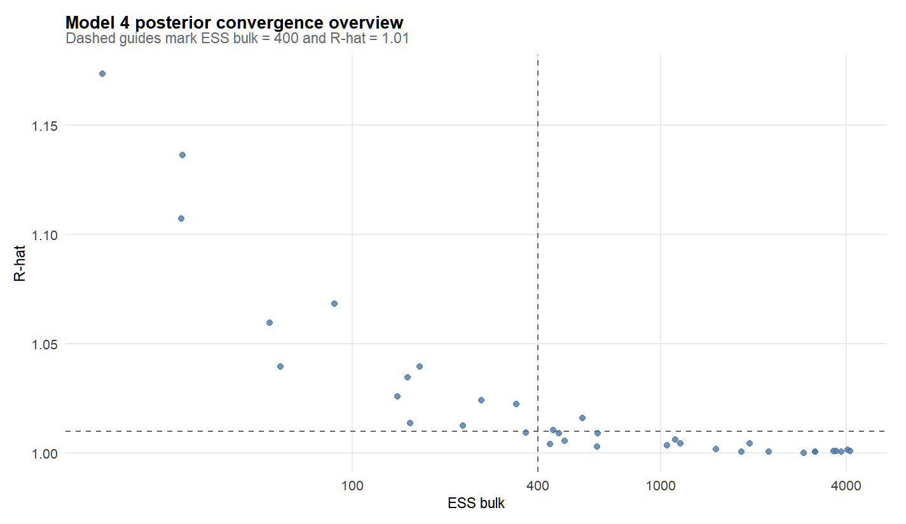
```

```{r bdlm-trace, echo=FALSE, out.width='90%'}
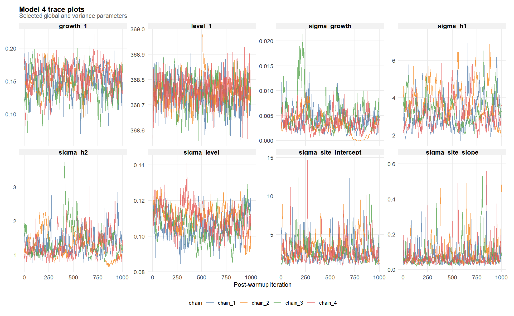
```

```{r bdlm-fit-plot, echo=FALSE, out.width='90%'}
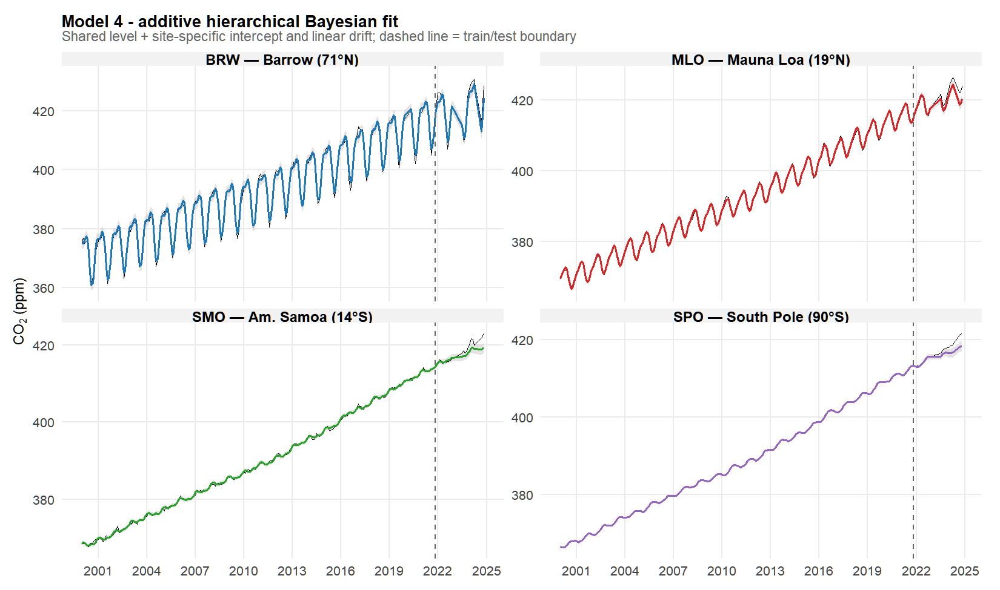
```

The saved fit plot shows why we still keep BDLM in the model set despite the harder sampling problem: it captures the broad shared CO$_2$ trajectory and the site-level seasonality very well, so it is substantively useful even though the computation is more fragile.

## Bayesian Dynamic Linear Model with Quadratic Observation Component (BDLMQ)

### Model specification

BDLMQ keeps the same latent local-linear-trend state as BDLM, but adds a site-specific quadratic observation component:

$$
\mu_n =
\ell_{t[n]}
+ a_{s[n]}
+ b_{s[n]} x_{t[n]}
+ c_{s[n]} x_{t[n]}^2
+ \mathrm{Season}_{s[n], m[n]}.
$$

The motivation is simple: if the shared latent level is still not flexible enough to absorb subtle long-run curvature differences across stations, a site-specific quadratic adjustment can help. This extension is still hierarchical because the site quadratic effects are shrunk toward a common mean-zero structure.

This is the same modeling logic that motivated the move from harmonic regression to Bayesian harmonic regression with a quadratic term: when the basic trend looks too rigid, add a small amount of curvature rather than changing the entire structure at once.

#### Prior design

Relative to BDLM, the only new parameter block is `site_quadratic`, whose scale parameter `sigma_site_quadratic` receives an exponential prior in `group-time-series/code/Rstan/BDLMQ.stan`. This keeps the extra curvature term available but regularized, so the model only uses it when the data clearly support it.

This is a case where a stronger prior is justified by model hierarchy. Once the shared latent trend is already dynamic, a site-specific quadratic term should usually be a small correction, not a second competing explanation for the whole time path. If that prior were weak, the model could let station-level curvature absorb variation that should really belong to the shared global signal.

So the stronger shrinkage on `sigma_site_quadratic` expresses a clear substantive preference: across stations, long-run CO$_2$ differences should mostly appear as offsets or mild slope differences, not as large independent curvatures. Strong station-specific bending is possible, but it should be rare enough that the model starts skeptical.

In that sense, the prior is protecting interpretability as well as fit. It keeps the latent shared trend as the main description of global CO$_2$ movement, while the quadratic site terms only adjust for residual station-specific shape differences.

### Stan code

```{r bdlmq-stan-code, results='asis'}
render_stan_file(file.path("..", "code", "Rstan", "BDLMQ.stan"))
```

### Compile and fit the model

The code is included for completeness but left unevaluated because this model is much slower to sample than BHRQ.

```{r bdlmq-fit, eval=FALSE}
library(rstan)

rstan::rstan_options(auto_write = TRUE)
options(mc.cores = parallel::detectCores())

bdlmq_mod <- rstan::stan_model(file = "../code/Rstan/BDLMQ.stan")

bdlmq_fit <- rstan::sampling(
  object = bdlmq_mod,
  data = stan_data_dlm,
  seed = 5440,
  chains = 4,
  cores = 4,
  iter = 2000,
  warmup = 1000,
  refresh = 200,
  control = list(adapt_delta = 0.98, max_treedepth = 13)
)
```

### Posterior diagnose

```{r bdlmq-posterior-summary, message=FALSE, warning=FALSE}
bdlmq_summary_path <- "../../results/4q/posterior/model4q_posterior_summary.csv"
bdlmq_sampler_path <- "../../results/4q/posterior/model4q_sampler_diagnostics.csv"

bdlmq_core <- read_posterior_table(
  bdlmq_summary_path,
  c(
    "level_1", "growth_1", "sigma_level", "sigma_growth",
    "sigma_site_intercept", "sigma_site_slope", "sigma_site_quadratic",
    "sigma_h1", "sigma_h2"
  )
)

knitr::kable(
  bdlmq_core,
  caption = "BDLMQ posterior summary for latent-state and curvature parameters"
)

knitr::kable(
  readr::read_csv(bdlmq_sampler_path, show_col_types = FALSE) %>%
    mutate(
      mean_stepsize = signif(mean_stepsize, 3),
      mean_accept_stat = round(mean_accept_stat, 3)
    ),
  caption = "BDLMQ sampler diagnostics by chain"
)

knitr::kable(
  diag_overview(bdlmq_summary_path),
  caption = "BDLMQ convergence overview"
)
```

The extra observation-level quadratic term does not resolve the hard posterior geometry. In fact, the saved diagnostics show more divergences than BDLM, together with persistent max-treedepth hits. So BDLMQ is a useful modeling idea, but not an obvious computational improvement.

These BDLMQ panels are generated by the same single-model plotting helpers already shown above.

```{r bdlmq-rhat-ess, echo=FALSE, out.width='90%'}
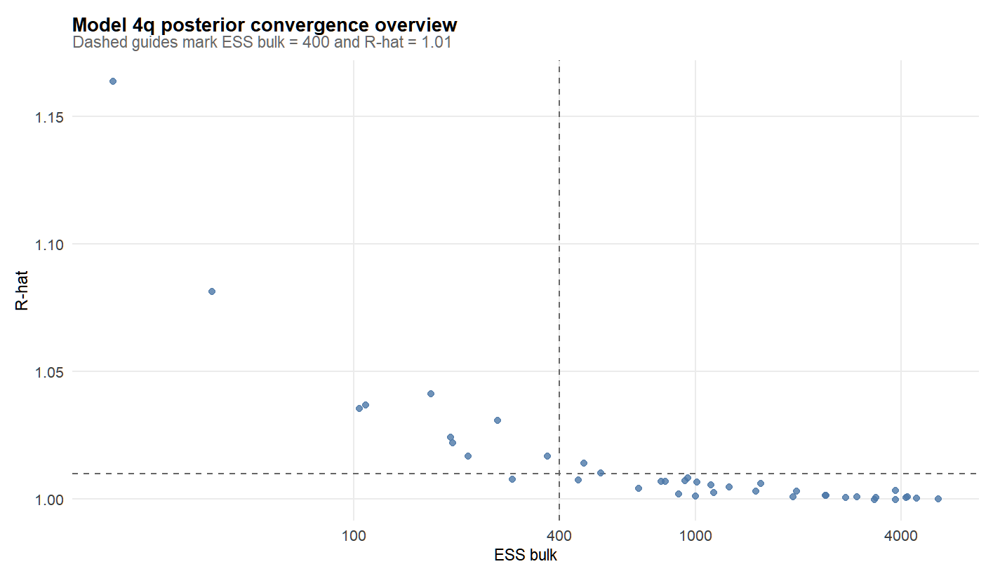
```

```{r bdlmq-trace, echo=FALSE, out.width='90%'}
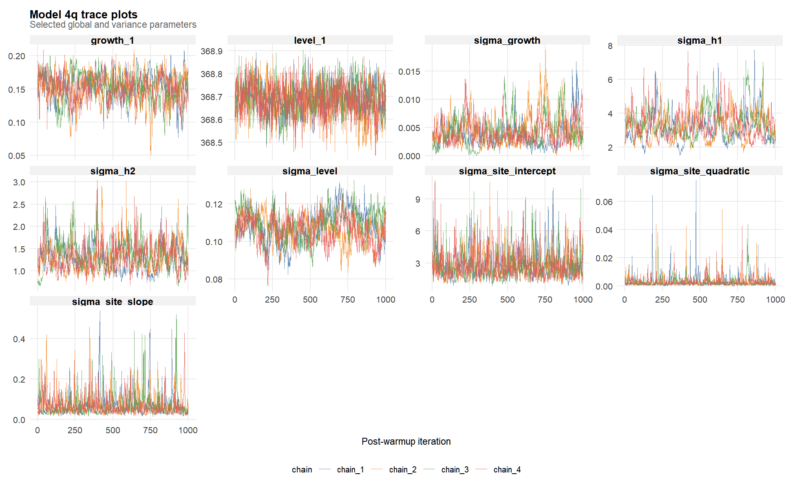
```

```{r bdlmq-fit-plot, echo=FALSE, out.width='90%'}
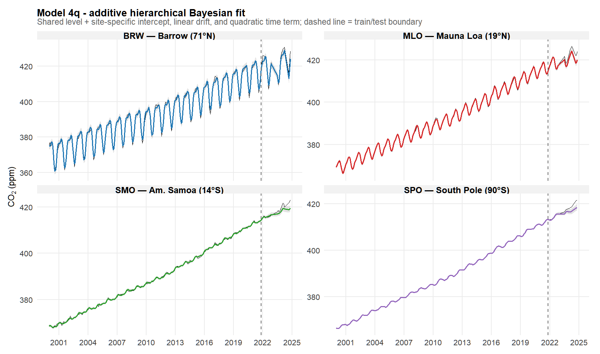
```

Qualitatively, BDLMQ still fits the series well, but the posterior diagnostics suggest that the extra flexibility should be treated cautiously unless one is willing to spend more effort on reparameterization or stronger priors.

## Bayesian Dynamic Linear Model with AR(2) Latent Residual Extension (BDLM-AR2)

### Model specification

The final extension keeps the shared latent level, site intercepts, site slopes, and seasonal harmonics from BDLM, but adds a station-specific latent AR(2) residual process:

$$
\mu_n =
\ell_{t[n]}
+ a_{s[n]}
+ b_{s[n]} x_{t[n]}
+ \mathrm{Season}_{s[n], m[n]}
+ r_{s[n], t[n]},
$$

where

$$
r_{s,t} = \phi_{1,s} r_{s,t-1} + \phi_{2,s} r_{s,t-2} + u_{s,t},
\qquad
u_{s,t} \sim \mathcal{N}(0, \sigma_{\mathrm{ar}, s}^2).
$$

The Stan program uses a partial-autocorrelation parameterization and the Durbin-Levinson mapping so that the implied AR(2) coefficients remain in the stationary region. Conceptually, this model tries to absorb the residual serial dependence that still appears after fitting BDLM.

The motivation here comes from the residual ACF diagnostics and from comparison with classical time-series ideas: a model can forecast reasonably well and still leave obvious short-memory dependence in the residuals. The AR(2) layer is meant to target exactly that leftover dependence.

#### Prior design

The additional AR(2) block introduces hierarchical priors on the latent partial autocorrelations, residual innovation scales, and AR residual initial states. This is the richest and most flexible model in the tutorial, but it is also the hardest to sample well because it combines high-dimensional latent states with near-boundary dependence parameters.

Those priors are needed for both scientific and computational reasons. Scientifically, the AR layer is only meant to capture leftover short-memory dependence after the shared trend and seasonality have already done the main work. That means we do not want the residual process to start out extremely strong by default. A shrinkage prior is therefore appropriate: short-run persistence may be present, but it should enter as a refinement, not as the dominant source of structure.

The partial-autocorrelation parameterization also makes it possible to use informative regularization while respecting stationarity. This matters because near-boundary AR behavior would imply very persistent residual dynamics, and that can easily become indistinguishable from slow latent-trend movement. In a monthly CO$_2$ setting, that is usually too strong a default assumption unless the data insist on it.

This is also the model where strong prior control is most defensible computationally. Dependence parameters close to the stationarity boundary create sharp posterior geometry and unstable sampling, so the priors are not only saying what kinds of short-run persistence are scientifically plausible; they are also preventing the model from wandering into pathological regions too easily.

### Stan code

```{r bdlm-ar2-stan-code, results='asis'}
render_stan_file(file.path("..", "code", "Rstan", "BDLM_AR2.stan"))
```

### Compile and fit the model

This code is also left unevaluated in the tutorial because the AR(2) latent-residual extension is the most computationally expensive model in the project.

```{r bdlm-ar2-fit, eval=FALSE}
library(rstan)

rstan::rstan_options(auto_write = TRUE)
options(mc.cores = parallel::detectCores())

bdlm_ar2_mod <- rstan::stan_model(file = "../code/Rstan/BDLM_AR2.stan")

bdlm_ar2_fit <- rstan::sampling(
  object = bdlm_ar2_mod,
  data = stan_data_dlm,
  seed = 5440,
  chains = 4,
  cores = 4,
  iter = 2000,
  warmup = 1000,
  refresh = 200,
  control = list(adapt_delta = 0.98, max_treedepth = 13)
)
```

### Posterior diagnose

```{r bdlm-ar2-posterior-summary, message=FALSE, warning=FALSE}
bdlm_ar2_summary_path <- "../../results/co2_model_2_upgrade_ar2/posterior/model_ar2_posterior_summary.csv"
bdlm_ar2_conv_path <- "../../results/co2_model_2_upgrade_ar2/posterior/model_ar2_posterior_convergence.csv"

bdlm_ar2_core <- read_posterior_table(
  bdlm_ar2_summary_path,
  c(
    "level_1", "growth_1", "sigma_level", "sigma_growth",
    "sigma_site_intercept", "sigma_site_slope", "sigma_h1", "sigma_h2",
    "mu_pacf1", "mu_pacf2", "sigma_pacf1", "sigma_pacf2"
  )
)

knitr::kable(
  bdlm_ar2_core,
  caption = "BDLM-AR2 posterior summary for latent-state and AR(2) hyperparameters"
)

knitr::kable(
  readr::read_csv(bdlm_ar2_conv_path, show_col_types = FALSE) %>%
    mutate(across(everything(), ~ round(.x, 3))),
  caption = "BDLM-AR2 convergence summary"
)
```

This final model is the clearest example of the tradeoff between model richness and posterior geometry. The AR(2) residual layer is substantively attractive because it directly targets remaining short-memory structure, but the saved convergence summary shows very large $\hat{R}$ values and extremely small ESS for some parameters. That means the posterior should be interpreted much more cautiously than the earlier models.

As before, the posterior and fit panels below come from the same `visualize_single_model.R` plotting functions, now applied to the AR(2) result directory.

```{r bdlm-ar2-rhat-ess, echo=FALSE, out.width='90%'}
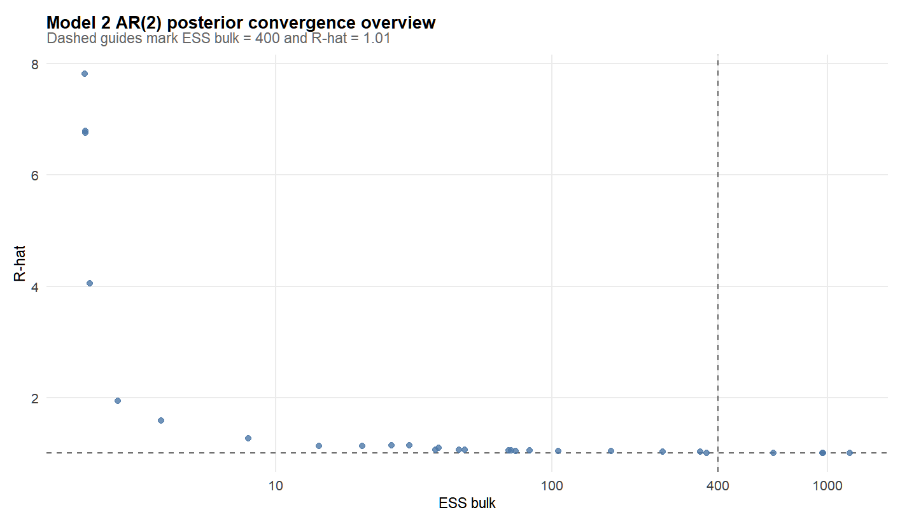
```

```{r bdlm-ar2-trace, echo=FALSE, out.width='90%'}
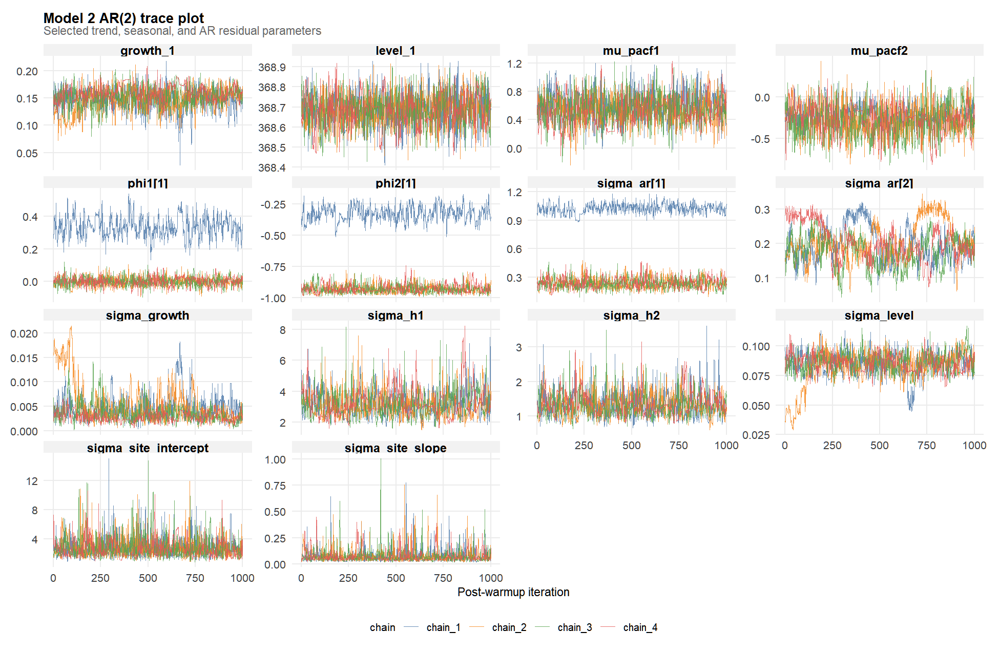
```

```{r bdlm-ar2-fit-plot, echo=FALSE, out.width='90%'}
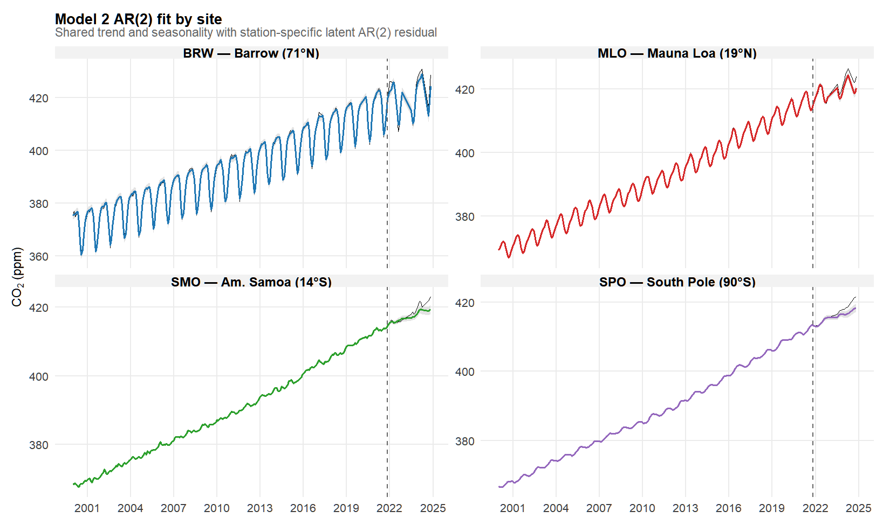
```

The fitted trajectories still look strong visually, but the diagnostic evidence indicates that this version is best read as an ambitious extension rather than as a fully stable final model.


#   Model Comparison {#model-comparison}

The model-comparison structure here follows the presentation slides: first compare holdout forecasts, then compare forecast metrics, then check residual diagnostics, and finally compare posterior diagnostics for the Bayesian models.

For the quantitative metrics, lower MAE and RMSE indicate smaller forecast error, while higher LPD indicates a better predictive distribution. Using all three together helps separate models that merely track the mean path from models that also quantify uncertainty well.

The first comparison figures below are generated by `group-time-series/code/Rscript/run_model_comparison.R`. I show the key plotting code once here; the later comparison panels in this section come from the same script.

```{r comparison-plot-code, results='asis'}
render_script_excerpt(file.path("..", "code", "Rscript", "run_model_comparison.R"), 257, 323)
```

```{r comparison-metrics, message=FALSE, warning=FALSE}
compare_metrics <- readr::read_csv(
  "../../results/1_4b_4_4q_ar2_compare_bundle/forecast/bundle_heldout_site_metrics.csv",
  show_col_types = FALSE
) %>%
  group_by(model) %>%
  summarize(
    mean_mae = round(mean(mae), 3),
    mean_rmse = round(mean(rmse), 3),
    mean_lpd = round(mean(lpd), 3),
    .groups = "drop"
  ) %>%
  arrange(mean_rmse)

knitr::kable(
  compare_metrics,
  caption = "Average 24-month holdout metrics across the four NOAA sites"
)
```

```{r comparison-forecast-panels, echo=FALSE, out.width='95%'}
knitr::include_graphics("../../plots/1_4b_4_4q_ar2_compare_bundle/forecast/bundle_heldout_forecast_panels.png")
```

```{r comparison-metric-bars, echo=FALSE, out.width='90%'}
knitr::include_graphics("../../plots/1_4b_4_4q_ar2_compare_bundle/forecast/bundle_heldout_metric_bars.png")
```

```{r comparison-residual-acf, echo=FALSE, out.width='95%'}
knitr::include_graphics("../../plots/1_4b_4_4q_ar2_compare_bundle/time_series/bundle_residual_acf_panels.png")
```

Across all sites, harmonic regression is clearly the weakest model. Its holdout forecasts miss the late-period trend badly and its residual ACF leaves substantial serial dependence. BHRQ is a major improvement, and the latent-state models are usually stronger still in point forecasting, but the forecasting gain is not uniform across every site and every metric.

For posterior diagnostics, the Bayesian ranking is different from the forecasting ranking. BHRQ has the cleanest posterior geometry, while BDLM and BDLMQ are harder to sample, and BDLM-AR2 is the most computationally fragile extension.

The posterior-comparison panels immediately below are produced by the same comparison script, using its Bayesian-only `Rhat/ESS` and trace-plot blocks.

```{r comparison-posterior-plot-code, results='asis'}
render_script_excerpt(file.path("..", "code", "Rscript", "run_model_comparison.R"), 350, 389)
```

```{r comparison-rhat-ess, echo=FALSE, out.width='90%'}
knitr::include_graphics("../../plots/1_4b_4_4q_compare_bundle/posterior/bundle_rhat_ess_panels.png")
```

```{r comparison-trace, echo=FALSE, out.width='95%'}
knitr::include_graphics("../../plots/1_4b_4_4q_compare_bundle/posterior/bundle_traceplot_panels.png")
```

So the comparison section points to a practical lesson: better model fit and better scientific structure do not automatically imply easier Bayesian computation. In this project, BHRQ is computationally safest, BDLM is the most interpretable latent-state compromise, and the richer extensions are promising but diagnostically more delicate.

More broadly, this sequence reflects the workflow of the project: start with a simple model, diagnose what it misses, and only then add complexity. The final contribution is not just one "best" model, but a defensible path of scientific refinement.


#   Interpretation {#interpretation}

The interpretation section follows the same storyline as our slides: shared latent trend, site-specific patterns, and seasonal structure.

## Shared latent trend and growth

```{r interpretation-latent-trend, echo=FALSE, out.width='90%'}
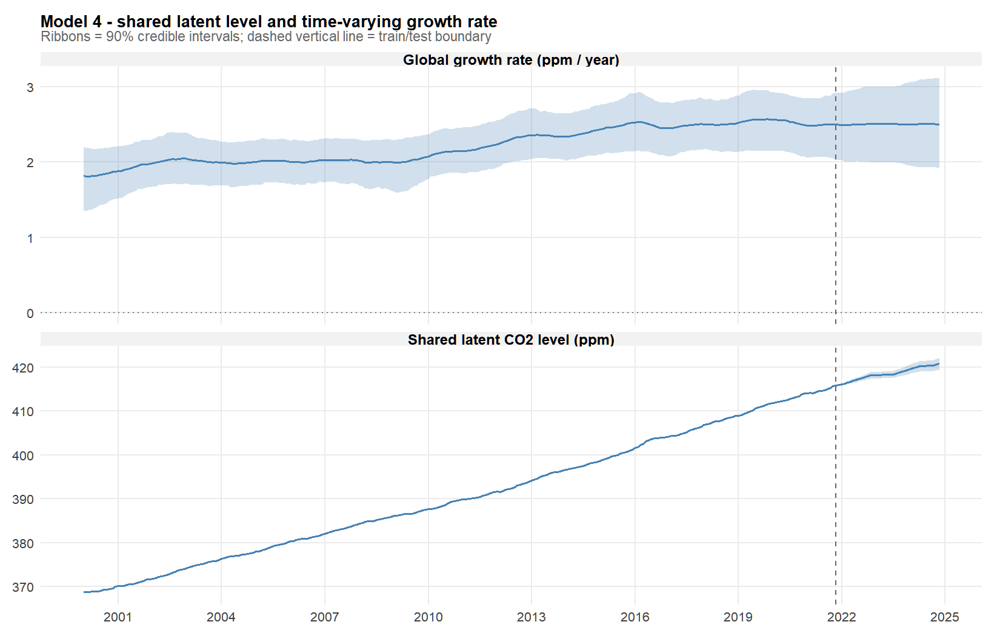
```

The latent-trend figure shows a smooth common background CO$_2$ signal rising from roughly the high-360s/low-370s ppm range at the start of the sample to above 420 ppm by the end. That is the core scientific payoff of the Bayesian DLM formulation: it separates the shared atmospheric signal from local site-specific deviations. The corresponding latent growth path stays positive throughout the sample and is generally larger in the later years, which is qualitatively consistent with the idea that atmospheric CO$_2$ is not only rising, but rising faster than in the early 2000s.

## Site-specific patterns

```{r interpretation-site-effects, echo=FALSE, out.width='90%'}
knitr::include_graphics(c(
  "../old_result/BDLM/key_results/04_model4_site_intercepts.png",
  "../old_result/BDLM/key_results/04_model4_site_slopes.png"
))
```

The site intercepts and slopes recover a clear north-south gradient. Northern Hemisphere stations sit above the shared latent level and tend to increase slightly faster, while Southern Hemisphere stations sit below the shared level and increase a bit more slowly. This matches the substantive story emphasized in the slides: the global CO$_2$ background is shared, but transport and emission geography create persistent station-level offsets.

Another advantage of the Bayesian formulation is that these station-level contrasts come with posterior uncertainty intervals in a natural way. That makes it easier to distinguish persistent structural differences from small local fluctuations.

## Seasonal harmonics

```{r interpretation-seasonality, echo=FALSE, out.width='90%'}
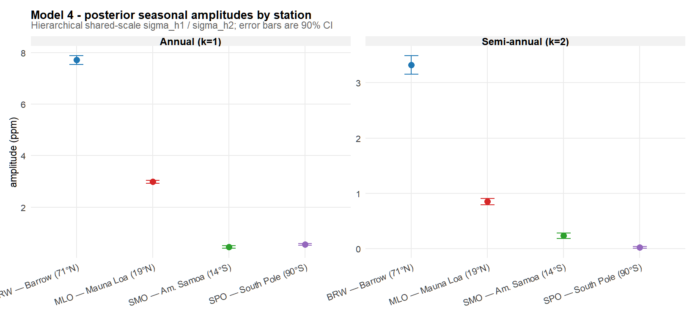
```

The seasonal amplitudes also match the expected carbon-cycle pattern. BRW has the strongest annual cycle, MLO is still clearly seasonal but smoother, and the Southern Hemisphere sites have weaker seasonal amplitudes. In other words, the hierarchical harmonic block is recovering a physically meaningful latitudinal structure rather than just fitting generic sine waves.


#   Limitations and Extensions {#limitations}

Even the stronger models in this tutorial still have clear limitations. First, computation is expensive: the richer latent-state models are much slower to fit and noticeably harder to sample than the simpler harmonic baseline. This is exactly why the `.Rmd` is set up to read saved outputs instead of re-running every heavy model during knitting.

Second, model diagnostics still matter even when forecasting looks strong. Some of the more flexible Bayesian models improve the fit and interpretation substantially, but they also introduce harder posterior geometry, while some residual ACF plots remain less clean than we would ideally like. So better scientific structure does not automatically imply easier computation or perfectly white residuals.

There is also a substantive limitation. The models are built around smooth latent evolution and recurring seasonality, so they do not explicitly account for major external shocks such as wildfire episodes or other climate anomalies. Sharp departures in the holdout period may therefore reflect real events that the current structure was not designed to explain directly.

Viewed as a whole, the project is best understood as an iterative modeling workflow rather than a claim that one final specification solves everything. Starting from simpler harmonic structure, moving to Bayesian curvature, then to dynamic latent trends, and finally to residual dependence extensions shows how diagnostics can guide model development in a principled way.
